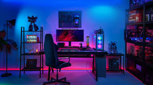
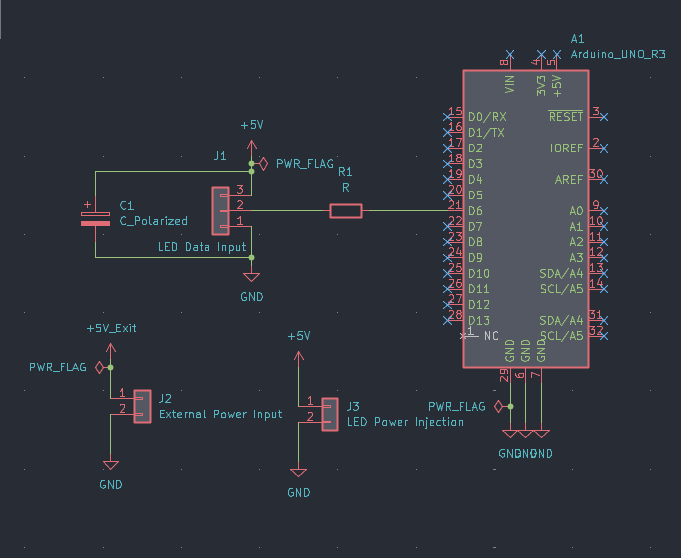
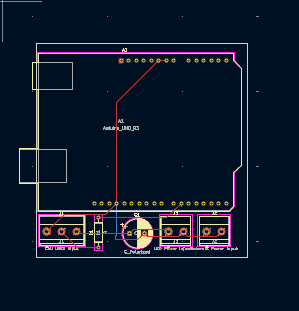
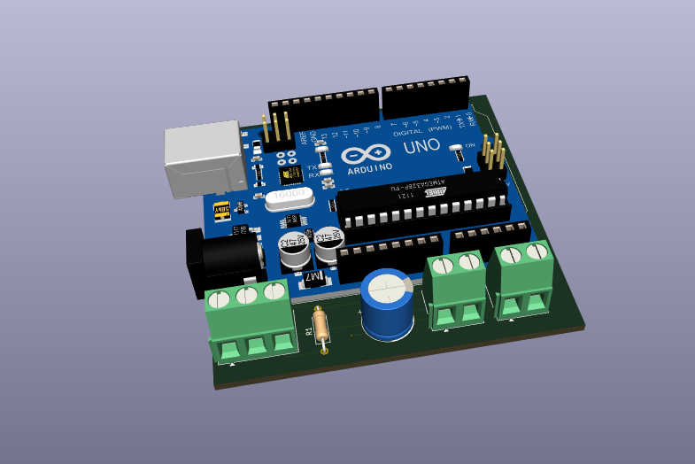

# Custom-Leds  
## This is a very small and basic project for my setup  
It consists of addressable leds powered by arduino  
This will look something like this when completed  
  

# Here is the schematics for it  
  

# Here is the PCB for this project  
  
And a 3D View  

I will flash custom software in arduino for the lights to match the average color of my laptop to give it a cool look , for now there is the basic firmware for it work  

# Here is the BOM   
|Component          |Quantity|Unit Price  |Total Price(with shipping )|Link to buy                                                                                                          |
|-------------------|--------|------------|---------------------------|---------------------------------------------------------------------------------------------------------------------|
|Arduino UNO R3     |1       |4.90$       |5.50$                      |https://robu.in/product/arduino-uno-r3/                                                                              |
|LED Strip          |1       |7.80$       |9.15$                      |https://quartzcomponents.com/products/led-strip-ws2812b-non-waterproof-60led-mtr                                     |
|Resistor           |1       |Self Sourced|                           |                                                                                                                     |
|Capacitor          |        |Self Sourced|                           |                                                                                                                     |
|Power Supply ( 5v )|1       |Self Sourced|                           |                                                                                                                     |
|Power Wire(16 AWG) |5m      |0.5$/m      |2.80$                      |https://quartzcomponents.com/products/16awg-silicone-wire-black-1-meter-high-quality-ultra-flexible-for-battery-packs|
|Data Wire(24 AWG)  |1m      |0.20$       |0.50$                      |https://quartzcomponents.com/products/24awg-silicone-wire-red-1-meter-high-quality-ultra-flexible-for-battery-packs  |
|Terminal Blocks    |3       |0.05$       |0.20$                      |https://quartzcomponents.com/products/3-pin-pcb-mount-terminal-block-screw-type?_pos=1&_sid=d264533dd&_ss=r          |
|                   |        |            |                           |                                                                                                                     |
|                   |        |TOTAL       |18$ approx                 |                                                                                                                     |

